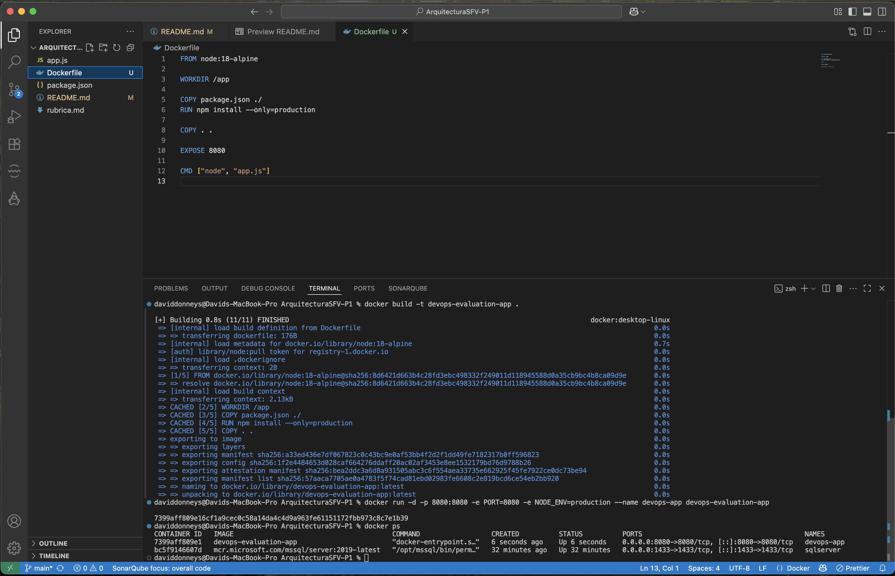
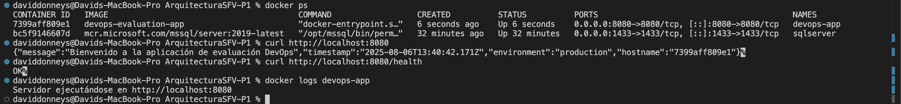

# ArquitecturaSFV-P1

# Evaluación Práctica - Ingeniería de Software V

## Información del Estudiante
- **Nombre: David Donneys**
- **Código: A00396036**
- **Fecha: Agosto 6, 2025**

## Resumen de la Solución
Implementé una solución de contenerización para una aplicación Node.js usando Docker. La aplicación funciona correctamente en un contenedor y está configurada para ejecutarse en el puerto 8080 con variables de entorno de producción.

## Dockerfile
Creé un Dockerfile simple y funcional:

### Características:
1. **Imagen Base**: Uso `node:18-alpine` porque es ligera
2. **Cache**: Copio `package.json` primero para aprovechar el cache
3. **Dependencias**: Solo instalo dependencias de producción
4. **Puerto**: Expongo el puerto 8080

### Estructura:
- Imagen base Node.js Alpine
- Directorio de trabajo `/app`
- Instalación de dependencias
- Copia del código
- Exposición del puerto 8080
- Comando de inicio

## Script de Automatización
*no lo hice*

## Principios DevOps Aplicados
1. **Infrastructure as Code**: El Dockerfile define la infraestructura de manera declarativa
2. **Containerización**: Docker asegura consistencia entre entornos
3. **Immutable Infrastructure**: Los contenedores son inmutables
4. **Configuration Management**: Variables de entorno para configuración

## Captura de Pantalla




## Mejoras Futuras
1. **CI/CD Pipeline**: Implementar GitHub Actions para construcción y despliegue automático
2. **Docker Compose**: Crear un archivo docker-compose.yml para orquestación multi-contenedor
3. **Health Checks**: Agregar health checks nativos de Docker para monitoreo automático

## Instrucciones para Ejecutar

### Prerrequisitos
- Docker Desktop instalado y ejecutándose
- Puerto 8080 disponible en el sistema

### Pasos:

1. **Construir la imagen:**
   ```bash
   docker build -t devops-evaluation-app .
   ```

2. **Ejecutar el contenedor:**
   ```bash
   docker run -d -p 8080:8080 -e PORT=8080 -e NODE_ENV=production --name devops-app devops-evaluation-app
   ```

3. **Verificar funcionamiento:**
   ```bash
   curl http://localhost:8080
   curl http://localhost:8080/health
   ```

4. **Detener:**
   ```bash
   docker stop devops-app
   docker rm devops-app
   ```
